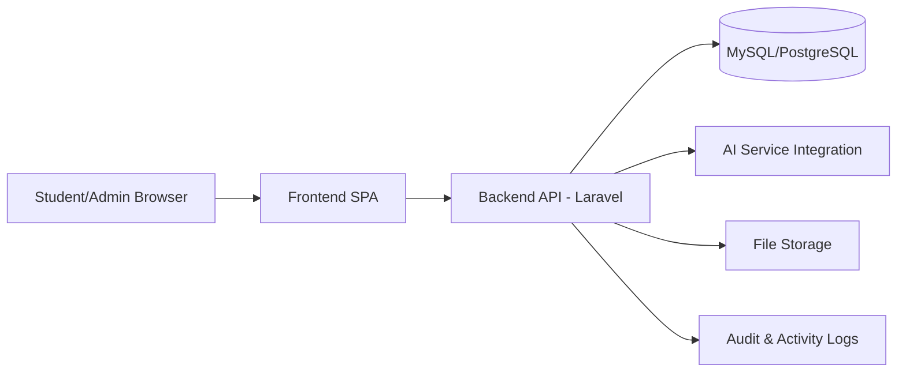

# Professional Practice Audit of a Nigerian Software System

## Course: Software Engineering Professional Practice (CSE403)
## Level: 400
## Assessment Type: Individual Assignment
## Student: [Your Name]
## Matric Number: [Your Matric Number]
## Department: [Your Department]
## Institution: [Your Institution]
## Date: [Submission Date]

---

## Abstract
This report presents a professional practice audit of a Nigerian educational software platform: an AI-powered academic support system for tertiary students. The system supports syllabus upload, topic extraction, pre-testing, adaptive study recommendations, semester timetable generation, reading handouts, and performance tracking. The audit evaluates the platform across ethical principles, legal/regulatory obligations, software engineering standards, documentation maturity, cybersecurity risks, professional liability, trade-off decisions, team communication practices, and macroeconomic impact in Nigeria. The review is aligned with Nigerian legal instruments including the Nigeria Data Protection Act (NDPA) 2023, Cybercrimes (Prohibition, Prevention, etc.) Act 2015 (as amended), and Copyright Act 2022, with reference to NITDA guidance and internationally recognized frameworks (ISO/IEC 12207, ISO/IEC 27001, ISO/IEC 25010). Findings show strong functional relevance and social value but identify key gaps in formal documentation depth, explicit legal controls, and operational security governance. Actionable recommendations are provided to improve compliance, accountability, resilience, and professional maturity.

---

## 1. Introduction

### 1.1 Description of the Selected System
The selected system is a Nigerian-oriented AI-enabled student productivity and academic planning platform. It is built as a web system with student and admin capabilities. Core workflows include:
- Uploading course material and extracting structured learning topics.
- Running diagnostic tests (pre-tests and periodic assessments).
- Generating weak-topic guidance and study suggestions.
- Building semester-wide timetables and weekly reading plans.
- Producing downloadable handouts.
- Tracking progress and academic performance.

The system addresses a real local need: many Nigerian students face high course load, limited personalized learning support, and fragmented study practices.

### 1.2 Stakeholders Involved
Primary stakeholders include:
- Students (end users and data subjects).
- Platform administrators.
- Software engineers (frontend, backend, DevOps, QA).
- AI service provider(s) used for text analysis and content generation.
- Educational institutions and instructors (indirect stakeholders).
- Nigerian regulators (NITDA, data protection authorities, law enforcement under cybercrime laws).

### 1.3 Scope of Analysis
This audit covers:
- Ethical conduct in AI-assisted academic software.
- Nigerian legal and regulatory compliance.
- Standards and quality assessment.
- Documentation and traceability readiness.
- Cybersecurity and risk management.
- Engineering trade-offs.
- Team coordination and communication.
- Economic and national-level impact.

### 1.4 Importance in Nigerian Context
The platform is relevant to Nigeria’s digital education push and broader digital economy strategy. It can improve student learning outcomes, reduce inefficiencies in personal study management, and advance inclusive educational technology adoption. Its legal and ethical compliance profile is crucial because it processes personal data and educational content at scale.

---

## 2. System Overview

### 2.1 High-Level Architecture
The system follows a web application architecture with API-driven interactions.

### 2.2 Data Flow Description
1. User authenticates and receives session/token access.
2. Student uploads course material (PDF/image/text).
3. Backend extracts and stores content metadata.
4. AI service processes content for topics, tests, handouts, or recommendations.
5. Backend persists outputs (courses, tests, suggestions, schedules).
6. Frontend renders personalized dashboards and plans.
7. Logs capture activity for accountability and monitoring.

### 2.3 Core Functionalities
- Authentication and profile management.
- Course ingestion and topic extraction.
- Assessment generation and scoring.
- Reading plan and timetable generation.
- Study room and progress tracking.
- Admin reporting, logs, notifications, and user control.

### 2.4 User Categories
- Guest users (limited/public access).
- Authenticated students (academic workflows).
- Admin users (governance and operational control).

---

## 3. Ethical Analysis

### 3.1 Key Ethical Issues
- **Data privacy and consent:** Students may upload sensitive educational data.
- **AI transparency:** Users may not know how recommendations are generated.
- **Bias and fairness:** AI outcomes may vary by quality of uploaded material.
- **Academic integrity risk:** Over-reliance on AI-generated answers could undermine learning.

### 3.2 Confidentiality
Confidentiality is required for personal profiles, performance records, and uploaded course documents. Unauthorized disclosure may cause reputational, academic, or legal harm.

### 3.3 Integrity
Assessment scores, progress records, and generated plans must remain tamper-resistant. Integrity failures can mislead students and degrade trust.

### 3.4 Accountability
Professional accountability requires traceability for:
- User actions (uploads, submissions, edits).
- Admin actions (role changes, notifications, moderation).
- AI-dependent outputs and system decisions.

### 3.5 Ethical Position
The system is ethically beneficial when used as guidance support, not as a replacement for student effort. Ethical maturity improves when transparency notices, use limitations, and appeal mechanisms are explicit.

---

## 4. Legal and Regulatory Compliance (Nigeria)

### 4.1 NDPA 2023 Compliance
Under NDPA 2023, this system should demonstrate:
- Lawful basis for processing (consent/contract/legitimate interest).
- Purpose limitation and data minimization.
- Data subject rights handling (access, rectification, erasure, portability where applicable).
- Security safeguards for personal data.
- Breach handling and notification obligations.

**Current compliance posture (assessment):** partially aligned in principle, but requires stronger formal documentation and operational procedures (privacy notice depth, retention policy, DSR workflow evidence).

### 4.2 Cybercrimes Act 2015 (as amended)
The platform should prevent and respond to:
- Unauthorized access and credential theft.
- Data manipulation and service abuse.
- Malicious file upload/use.

Required controls include access control, abuse monitoring, and log retention for investigative support.

### 4.3 Copyright Act 2022
Users may upload copyrighted academic materials. The system should:
- Enforce user responsibility declarations.
- Prevent unlawful redistribution.
- Clarify fair-use/educational boundaries.

### 4.4 CBN/NITDA Guidance (where applicable)
Although not a banking product, if integrated payment or financial workflows emerge, CBN guidelines become directly relevant. NITDA data governance and secure development expectations remain relevant now.

### 4.5 Data Subject Rights and Breach Obligations
The system must operationalize:
- Rights request channels.
- SLA-backed response process.
- Incident response plan with notification procedures.

---

## 5. Standards Evaluation

### 5.1 NITDA Secure Development Orientation
A compliant Nigerian software posture should include risk-based design, secure coding, vulnerability handling, and governance accountability.

### 5.2 ISO/IEC 12207 Lifecycle Processes
Lifecycle evidence should cover:
- Requirements definition.
- Architectural design.
- Coding and integration.
- Verification and validation.
- Deployment and operations.
- Maintenance and change control.

### 5.3 ISO/IEC 27001 Security Framework
The system should align with controls around:
- Access management.
- Asset inventory.
- Incident management.
- Logging and monitoring.
- Third-party risk management.
- Business continuity.

### 5.4 ISO/IEC 25010 Quality Characteristics
#### Functional suitability
Strong, with meaningful student-centric features.

#### Reliability
Moderate; dependent on service availability and AI response consistency.

#### Security
Moderate; technical mechanisms exist but formal governance hardening is needed.

#### Maintainability
Moderate; architecture is extensible but documentation and naming consistency should improve.

#### Performance efficiency
Generally acceptable but could degrade under high AI workload and file-processing spikes.

---

## 6. Documentation Assessment

### 6.1 SRS Evaluation
A complete SRS should clearly define:
- Functional and non-functional requirements.
- User roles and constraints.
- Compliance/security requirements.
- Acceptance criteria.

**Assessment:** The system appears implementation-driven. SRS maturity is likely below enterprise standard and should be formalized.

### 6.2 SDD Evaluation
An SDD should document:
- API boundaries and component architecture.
- Data models and relationship logic.
- Integration contracts (AI, file handling, notifications).

**Assessment:** Technical structure exists but needs better formal design documentation for maintainability and onboarding.

### 6.3 Test Documentation
Expected artifacts:
- Test plan.
- Test cases and expected outcomes.
- Security test evidence.
- Regression logs.

**Assessment:** Testing exists at code level, but formal test documentation should be strengthened for auditability.

### 6.4 Traceability and Audit Trails
Traceability should connect:
- Requirement -> code module -> test -> deployment evidence.
- User/admin action -> timestamp -> actor -> outcome.

**Assessment:** Logging exists, but full requirement-to-test traceability matrix is recommended.

---

## 7. Cybersecurity and Risk Analysis

### 7.1 Threat Identification
- Credential compromise and session hijack.
- Broken access control (role bypass).
- Insecure file uploads.
- Prompt injection or unsafe AI output handling.
- API abuse and denial-of-service patterns.
- Data leakage through logs or storage misconfiguration.

### 7.2 Professional Liability Risks
Potential liabilities include:
- Privacy violations and regulatory penalties.
- Harm from inaccurate or misleading AI academic guidance.
- Service outages causing educational disruption.

### 7.3 Risk Mitigation Recommendations
- Enforce stricter RBAC and authorization checks.
- Apply upload scanning/content type validation and size limits.
- Add robust API throttling and anomaly detection.
- Encrypt sensitive data at rest and in transit.
- Maintain immutable security/audit logs.
- Conduct periodic vulnerability assessments and penetration testing.
- Establish and rehearse an incident response plan.

---

## 8. Trade-Off Analysis

### 8.1 Security vs Usability
- More friction (MFA, strict sessions) may reduce convenience.
- Reduced friction increases user satisfaction but raises abuse risk.

**Recommended balance:** adaptive security (risk-based prompts) and clear UX guidance.

### 8.2 Cost vs Performance
- AI-heavy features increase compute/API costs.
- Cost controls may reduce responsiveness/feature richness.

**Recommended balance:** caching, tiered AI usage, and performance budgets.

### 8.3 Scalability vs Complexity
- Monolithic simplicity eases short-term development.
- Scalable modular services improve growth readiness but raise operational complexity.

**Recommended balance:** modularize critical subsystems incrementally (AI processing, notifications, analytics).

---

## 9. Team Dynamics and Communication

### 9.1 Likely Team Structure
- Product owner/project lead.
- Backend engineer(s).
- Frontend engineer(s).
- QA/security tester.
- DevOps/release engineer.
- Compliance/legal advisor (part-time role).

### 9.2 Collaboration Tools
- GitHub for version control and code review.
- Jira/Trello for sprint planning and issue tracking.
- Slack/Teams/WhatsApp for communication.
- CI/CD pipelines for build/test/release discipline.

### 9.3 Communication Risks
- Unclear ownership of security/compliance tasks.
- Requirement drift from rapid feature delivery.
- Delayed incident communication.

**Mitigation:** RACI ownership matrix, definition-of-done including compliance checks, and incident communication playbook.

---

## 10. Economic and National Impact

### 10.1 Contribution to Digital Economy
The system contributes to Nigeria’s digital economy by:
- Advancing education technology adoption.
- Encouraging cloud/software skill development.
- Supporting local innovation in AI-assisted learning.

### 10.2 Financial Inclusion and Public Efficiency
While not directly a fintech product, it improves educational efficiency and may lower personal tutoring costs through structured digital guidance.

### 10.3 Economic Risk if System Fails
Failure could cause:
- Loss of student trust in digital learning tools.
- Academic planning setbacks.
- Reputational and financial risk to operators.

---

## 11. Recommendations

### 11.1 Ethical Improvements
- Add transparent AI explanation notices.
- Add user controls to flag/contest AI outputs.
- Include academic integrity warnings for generated answers.

### 11.2 Legal Compliance Enhancements
- Publish NDPA-aligned privacy notice with legal basis details.
- Implement formal data retention/deletion schedule.
- Create documented Data Subject Request handling procedure.

### 11.3 Security and Documentation Improvements
- Formalize ISO-style security policy and risk register.
- Improve SRS/SDD and maintain requirement-to-test traceability matrix.
- Automate security checks in CI/CD.
- Conduct periodic audits and compliance reviews.

### 11.4 Operational Maturity
- Define SLAs and error budgets.
- Add backup/restore drills and disaster recovery testing.
- Introduce KPI dashboard for reliability and compliance metrics.

---

## 12. Conclusion
This platform demonstrates meaningful practical value and a strong foundation for Nigerian digital education support. Its professional maturity is moderate: the feature set is robust and impactful, but compliance formalization, security governance depth, and documentation rigor should be strengthened. The most significant risks are legal accountability for personal data processing, cybersecurity exposures in a growing user base, and long-term maintainability without stronger lifecycle artifacts. The professional responsibility of the engineering team is to ensure that innovation remains lawful, secure, transparent, and educationally beneficial.

---

## References (APA Style)

Central Bank of Nigeria. (n.d.). *Regulatory framework and guidelines*. https://www.cbn.gov.ng

Federal Republic of Nigeria. (2015, amended). *Cybercrimes (Prohibition, Prevention, etc.) Act*.

Federal Republic of Nigeria. (2022). *Copyright Act, 2022*.

Federal Republic of Nigeria. (2023). *Nigeria Data Protection Act, 2023*.

International Organization for Standardization. (2011). *ISO/IEC 25010:2011 Systems and software engineering - Systems and software quality requirements and evaluation (SQuaRE) - System and software quality models*.

International Organization for Standardization. (2017). *ISO/IEC/IEEE 12207:2017 Systems and software engineering - Software life cycle processes*.

International Organization for Standardization. (2022). *ISO/IEC 27001:2022 Information security, cybersecurity and privacy protection - Information security management systems - Requirements*.

National Information Technology Development Agency. (n.d.). *Guidelines and frameworks for digital services and data protection in Nigeria*. https://nitda.gov.ng

---

## Appendix A: Suggested Evidence Checklist for Submission
- Screenshots of major system modules (dashboard, course upload, timetable, tests, admin panel).
- Sample anonymized data flow diagram.
- Security control mapping table.
- Requirement-to-test traceability sample.
- Compliance gap matrix (current state vs required state).
